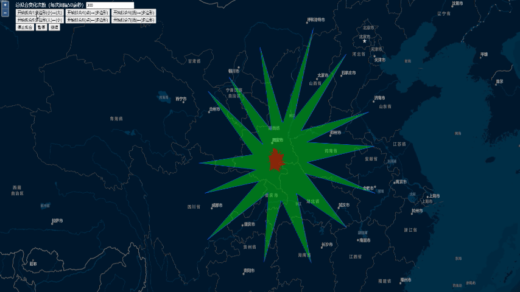

# FreeformGeometry

实现多边形，线，点之间的动态拟合变化方法。

Methods about Polygon,LineString,Point dynamic fitting.



关键类[`DynamicFit`](./libs//DynamicFit.js)

使用use：

```javascript
const df = new DynamicFit(map, { color: "#cc0000aa" });//options about style

const point = new ol.geom.Point...
const line = new ol.geom.LineString...
const polySmall = new ol.geom.Polygon...
const polyBig = new ol.geom.Polygon...
df.startPolygon = (polySmall);//Polygon|LineString|Point
df.endPolygon = (polyBig);//Polygon|LineString|Point
df.fit(opts,callback Method);
```
